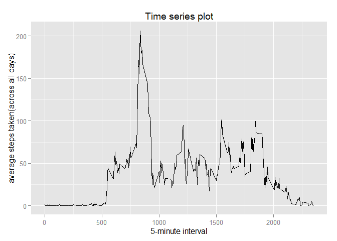
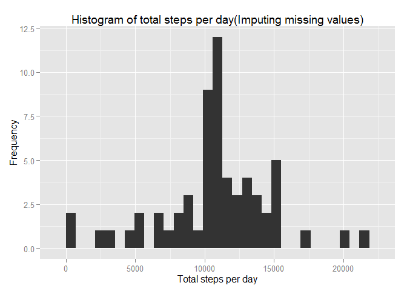
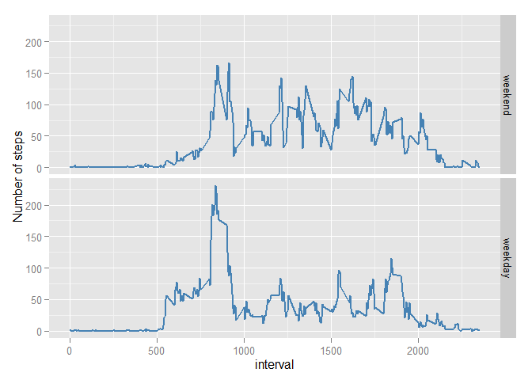

# Reproducible Research: Peer Assessment 1


## Loading and preprocessing the data


```r
# Loading required libraries
library(dplyr)
library(ggplot2)
# read csv file
activity <- read.csv("activity/activity.csv", header = T)
# type casting activity data frame into tbl_df for better viewing and handling.
activity <- tbl_df(activity)
# Converting date in data frame to Date class.
activity$date <- as.Date(activity$date, format="%Y-%m-%d")
```

## What is mean total number of steps taken per day?


```r
# Remove na from data frame
activity_without_na <- na.omit(activity)
# Group by date 
activity_by_date <- group_by(activity_without_na, date)
# summarize to find total number of steps taken per day
total_steps_date_wise <- summarize(activity_by_date, total_steps=sum(steps, na.rm = T))
# plotting histogram of total number of steps taken each day.
qplot(total_steps, data=total_steps_date_wise, geom="histogram", xlab = "Total steps per day", ylab="Frequency", main = "Histogram of total steps per day")
```

 

```r
#calculation of mean and median of the total number of steps taken per day.
Mean <- mean(total_steps_date_wise$total_steps)
Median <- median(total_steps_date_wise$total_steps)
```
Mean of total steps per day is : **10766.1886792453**.  
Median of total steps per day is : **10765**.

## What is the average daily activity pattern?


```r
# grouping activity dataset by interval
activity_by_interval <- group_by(activity_without_na, interval)
# Find average steps taken for all days
average_steps_taken <- summarize(activity_by_interval, average=mean(steps))
# plotting time series plot
time_series_plot <- ggplot(average_steps_taken, aes(interval, average))
# adding layers to ggplot with labels and title
time_series_plot + geom_line() + labs(title="Time series plot") + labs(x="5-minute interval") + labs(y="average steps taken(across all days)")
```

 

```r
# Finding 5-minute interval where steps taken are more
max_interval <- average_steps_taken[average_steps_taken$average==max(average_steps_taken$average),]
print(max_interval)
```

```
## Source: local data frame [1 x 2]
## 
##   interval  average
## 1      835 206.1698
```
5- minute interval containing maximum number of steps is 835 and maximum steps taken are 206.1698113.


## Imputing missing values

```r
# making copy of original data set
activity_with_na <- activity
# filtering only NA values in different data set
na_values <- activity_with_na[is.na(activity_with_na$steps),]
# calculating total na values
total_na_values <- nrow(na_values)
# printing total na values
print(paste("Total NAs in dataset are ", total_na_values))
```

```
## [1] "Total NAs in dataset are  2304"
```

```r
# group by interval in data set
act_by_interval <- group_by(activity_with_na, interval)
# calculating mean of values other than na
averageData <- summarize(act_by_interval, mean=mean(steps, na.rm=T))
# selecting only required columns so imputed values can be binded later on
na_values <- select(na_values, date, interval)
# adding average of steps taken in place NA values
mergingAverage <- cbind(steps=averageData$mean, na_values)
# removing NAs so that imputed values can be added
activity_with_na <- na.omit(activity_with_na)
# merging imputed values with original data set.
activity_new_data <- rbind(mergingAverage, activity_with_na)

#calculation of total steps for each day and plotting histogram
activity_new_data <- tbl_df(activity_new_data)
act_by_date <- group_by(activity_new_data, date)
total_steps_df <- summarize(act_by_date, total_steps=sum(steps))
# plotting histogram of total number of steps taken each day.
qplot(total_steps, data=total_steps_df, geom="histogram", xlab = "Total steps per day", ylab="Frequency", main = "Histogram of total steps per day(Imputing missing values)")
```

 

```r
#calculation of mean and median of the total number of steps taken per day.
impMean <- mean(total_steps_df$total_steps)
impMedian <- median(total_steps_df$total_steps)
```
New mean after impputing missing values is : **10766.1886792453**.  
New Median after imputing missing values is : **10766.1886792453**.

After imputing missing values mean and median are same. Data is evenly distributed. In first part median was slightly different since missing values were not considered. After inserting missing values with average of 5-min interval, median value is increased and is now equal to mean value. Mean value is same as that of part 1. This proves that after imputing missing values, impact is only on median since values have increased and mean remains unchanged.


## Are there differences in activity patterns between weekdays and weekends?


```r
# define weekdays bank for calculation of factor(weekdays & weekends)
weekdaysBank <- c('Monday', 'Tuesday', 'Wednesday', 'Thursday', 'Friday')
# creating factor variable in the same dataset that has missing values filled in with two levels- weekday and weekend
activity_new_data$wday <- factor((weekdays(activity_new_data$date) %in% weekdaysBank) + 1L, levels=1:2, labels=c('weekend', 'weekday'))

# using same dataset that has filled in missing values, calculate average steps taken w.r.t to interval and days factor.
avgStepsWeekdays <- aggregate(activity_new_data$steps, list(intervalMean=activity_new_data$interval, wdays=activity_new_data$wday), mean)

#plotting time series plot of weekend and weekdays data w.r.t number of steps & interval.
time_s_plot <- ggplot(avgStepsWeekdays, aes(intervalMean, x))
time_s_plot + geom_line(color="steelblue", lwd=0.75) + facet_grid(wdays~.) + labs(x="interval") + labs(y="Number of steps")
```

 


From above plot it can be seen that between 500-1000 interval maximum steps taken over weekdays are more than weekends. After 1000 interval there is rise in number of steps over weekend then weekdays.
